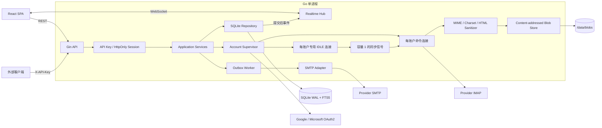
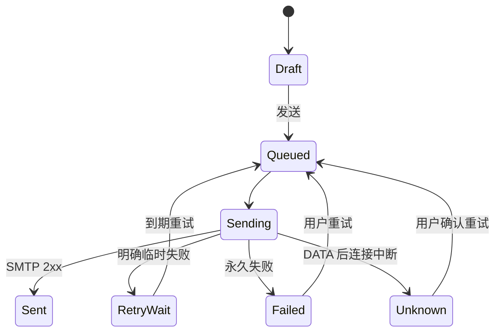

# NexusMail 统一邮件网关实施计划

> 状态：已确认并进入实施。本文是架构与验收的权威基线；数据库的可执行版本位于 [`migrations/000001_init.up.sql`](../migrations/000001_init.up.sql)，HTTP 契约位于 [`api/openapi.yaml`](../api/openapi.yaml)。

## 1. 总体方案

NexusMail 是单用户、自托管的统一邮件客户端，首版支持 QQ、163、Gmail 与 Outlook 的收取、搜索、状态管理、远端草稿同步和 SMTP 发信。



应用服务只依赖 ports；Gin、GORM、IMAP、SMTP 与 OAuth 都处于外围适配层。每账户最多使用两条 IMAP 长连接：IDLE 连接只监听并投递同步信号，命令连接负责搜索、拉取、标记与 APPEND，避免在 `IDLE` 阻塞期间复用同一客户端。

### 同步行为

- 首次同步最近 30 天。INBOX 使用实时 IDLE；Sent、Drafts、Archive 周期增量同步；Spam、Trash 和自定义文件夹按需同步。
- 游标以 `mailbox + UIDVALIDITY + UID` 为边界；UIDVALIDITY 变化时清空该 mailbox 的本地 UID 映射并重建。
- IDLE 每 20–25 分钟以抖动间隔退出重建；失败使用 1 秒至 5 分钟、带 full jitter 的指数退避；服务端不支持 IDLE 时每 30 秒轮询。
- 初始同步优先批量写入 Envelope、Headers 与 BODYSTRUCTURE。正文打开时高优先级抓取，初始同步后低优先级补齐不超过 1 MiB 的文本；正文全局并发 4、每账户 1；附件只在点击时下载。
- MIME 递归解析 multipart，兼容 UTF-8、GBK、GB2312、Base64 与 Quoted-Printable；HTML 服务端清洗并默认移除远程资源，CID 只解析本地内联附件。
- Gmail/Outlook 使用 OAuth 2.0 授权码 + PKCE + state。Refresh Token 以 AES-256-GCM 加密落库，Access Token 仅驻留内存；QQ/163 使用客户端授权码。

### 发信与草稿



- 纯文本编辑器生成规范的 `text/plain` MIME，支持 To/Cc/Bcc、回复引用和普通附件。
- 本地编辑 2 秒防抖保存；5 秒空闲后 APPEND 到远端 Drafts。远端修订先 APPEND 新版本，再删除旧 UID。
- 远端与本地按 `updated_at` 最近修改者优先；差值不超过 5 秒或时间不可用时保留冲突副本。
- SMTP 成功后立即创建本地 Sent，后续按 Message-ID 去重；需要时按 provider 策略 APPEND 到远端 Sent。
- 4xx 与 DATA 前网络失败最多自动重试 5 次；5xx 永久失败；DATA 后连接中断进入 `unknown`，必须人工确认重试。
- 原始附件总量默认上限 20 MiB，并服从服务端 SMTP `SIZE`。SMTP 每次任务临时连接并关闭。

## 2. 数据与索引

所有时间均为 UTC Unix 毫秒。SQLite 每条连接启用：

```sql
PRAGMA journal_mode = WAL;
PRAGMA synchronous = NORMAL;
PRAGMA foreign_keys = ON;
PRAGMA busy_timeout = 5000;
PRAGMA wal_autocheckpoint = 1000;
```

显式迁移定义以下表：

| 表 | 职责 |
|---|---|
| `accounts` | 服务商、连接参数、加密凭据与健康状态 |
| `mailboxes` | 角色、同步模式以及 UIDVALIDITY/UID/MODSEQ 游标 |
| `messages` | 归一化邮件、正文状态、统一流与去重键 |
| `mailbox_messages` | 邮箱 UID 到归一化邮件的多对多映射 |
| `attachments` | MIME part 元数据与按需 blob 状态 |
| `drafts` / `draft_attachments` | 乐观锁修订、远端 UID 与持久 outbox 状态 |
| `blob_objects` | SHA-256 内容寻址、耐久等级与 LRU 元数据 |
| `web_sessions` | 哈希会话、CSRF 与绝对过期时间 |

FTS5 使用 external-content + trigger，索引 `subject`、`sender`、`recipients` 与 `body_text`；三字符以上使用 trigram `MATCH`，1–2 字符回退参数化 `LIKE`。DDL 不使用 GORM AutoMigrate，完整定义见可执行迁移。

## 3. REST 与实时契约

- `POST/DELETE /api/v1/auth/session`：API Key 换取或注销 HttpOnly、SameSite=Strict 会话；变更请求校验 CSRF 与 Origin。
- `POST/GET /api/v1/accounts`、`GET /api/v1/accounts/:id/mailboxes`。
- `GET /api/v1/oauth/:provider/callback`：校验 state/PKCE、交换 token 并创建账户。
- `GET /api/v1/messages`：支持 account、mailbox、folder、read、query、cursor 与 limit；分页游标为 `(received_at,id)`。
- `GET/PATCH /api/v1/messages/:id`；正文未就绪时触发高优先抓取，最多等待 3 秒后返回 `202`。
- `GET /api/v1/messages/:id/attachments/:att_id`：按需抓取并流式下载。
- `GET/POST/PATCH/DELETE /api/v1/drafts`；PATCH 必须携带 `If-Match: <revision>`，冲突返回 `409`。
- 草稿附件、发送与人工重试端点；`GET /api/v1/ws`；`GET /healthz` 与 `GET /readyz`。

统一错误格式：

```json
{"error":{"code":"stable_machine_code","message":"human readable message","request_id":"request-id","details":{}}}
```

WebSocket 事件不持久化；断线后客户端重新获取 REST 首屏。事件包括 `NEW_EMAIL`、`MESSAGE_UPDATED`、`ACCOUNT_STATUS`、`SYNC_PROGRESS`、`DRAFT_UPDATED` 与 `OUTBOX_UPDATED`，并携带单调 sequence 和 UTC 毫秒时间。

## 4. 项目结构

```text
NexusMail/
├── cmd/server/main.go
├── internal/
│   ├── config/                 # 环境变量与 _FILE secrets
│   ├── domain/                 # 领域实体
│   ├── ports/                  # repository/provider/publisher 边界
│   ├── service/                # account/message/draft/send/session 用例
│   ├── repository/sqlite/      # GORM CRUD + 显式 SQL 热路径
│   ├── provider/{imap,smtp,oauth,auth}/
│   ├── transport/http/         # Gin、会话、CSRF、REST、SPA
│   ├── realtime/               # 有界 WebSocket hub
│   ├── mail/                   # MIME 解析、清洗与构造
│   ├── storage/                # 内容寻址 blob/LRU
│   └── platform/cryptobox/     # AES-256-GCM
├── migrations/                 # 嵌入式显式 SQL
├── web/                        # React + TypeScript + Tailwind + Vite
├── api/openapi.yaml
├── docs/architecture-plan.md
├── tests/{integration,fixtures}/
├── Dockerfile
├── docker-compose.yml
├── Makefile
└── README.md
```

## 5. 分阶段实施

1. 骨架、领域与存储：配置、显式 migration、FTS、写事务协调、加密、blob store 与单元测试。
2. IMAP 与同步：provider preset、密码/XOAUTH2、双连接 supervisor、LIST/SEARCH/UID/IDLE/退避、MIME 与远端草稿。
3. API、WebSocket 与发信：API Key/session/CSRF/Origin/限流、完整 REST、SMTP/outbox/Sent 协调及测试。
4. React 客户端：响应式三栏、虚拟/游标列表、实时更新、搜索、状态、附件、草稿、发信和快捷键。
5. 容器与验收：SPA 嵌入单二进制、Go 1.26 Alpine 多阶段构建、非 root、`/data` volume、健康检查和全测试矩阵。

## 6. 验收基线

- 10 账户、20 万封元数据、2 vCPU：普通 feed p95 < 100 ms，三字符 FTS p95 < 150 ms。
- IDLE 通知至 WebSocket 广播 < 250 ms；本地网络 UI 可见 < 1 秒（不含服务商延迟）。
- 10 个空闲账户 RSS 目标 < 150 MiB（不含文件页缓存）。
- 100 次断线/重连后 goroutine 与连接回归基线；不向 API 泄露 `database is locked`。
- FTS insert/update/delete/integrity-check；MIME 编码/嵌套/CID/恶意 HTML；SMTP 成功、4xx、5xx、OAuth 过期、DATA 后断线、重复发送与重启恢复全部覆盖。
- `go test -race -tags sqlite_fts5 ./...`、前端测试、Playwright、生产构建与容器健康检查通过。

## 7. 已确认边界与默认值

- 单用户自托管；无注册、租户与 RBAC。
- 首版仅 QQ、163、Gmail、Outlook；不开放自定义 IMAP。
- 不含联系人、日历、规则、PGP/S/MIME 与富文本编辑。
- Gin + GORM；普通 CRUD 用 GORM，迁移、FTS 和分页热路径用显式 SQL。
- 固定 `go-imap/v2` beta.8，并由 adapter 隔离预发布 API。
- 浏览器使用 HttpOnly Session；外部调用使用 `X-API-Key`。
- OAuth Client 由部署者配置，不依赖中央中转服务。
- 可重取 blob 默认按 2 GiB LRU 淘汰；草稿和 `unknown` 发送结果的附件必须持久保存。
- 日志禁止记录 API Key、token、授权码、邮件正文和附件名。
